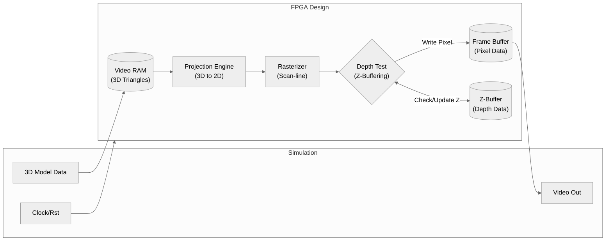

In this project, I wrote a simple 3D graphics rasterizer/renderer in SystemVerilog.
I learned a lot from this project, and there are definitely some ways that it could be improved, but *it worked* (at least in simulation, I never got to test it in hardware).

The FPGA design features a rendering pipeline that reads in triangle data from video memory, projects the 3D triangles in to 2D, and checks each pixel within the bounding box to see if it is within the triangle.
If it is, it calculates the depth (z position) of the point, compares it with the previous value for that pixel in the Z buffer, and if it is closer to the camera, then it updates the Z-buffer with the new value *and* updates the frame buffer with the color of the triangle.
After doing this for each triangle, the entire 3D model is effectively rendered to the screen, yielding a result like in the demo at the bottom of the page.
For this to work, at the start of every frame, every value within the frame buffer is cleared (set to black) and every value within the Z-buffer is set to a value representing being as far away from the camera as possible (within the limits of the fixed-point numbers I was using).

Accompanying the FPGA design is the simulation program, which I wrote using Verilator, a tool which translates (System)Verilog into C++, helping it to be simulated very fast.
The simulation program populates the video memory every frame with a spinning dragon 3D model, waits for the FPGA design to finish the frame, and then presents it with SDL.

Overall though, the design is pretty primitive.
To keep things simple, I wrote it to only render one pixel at a time, and it is not fully pipelined (i.e., it is a state machine where a clock cycle may only focus on one step of the rendering pipeline).
In the future, I may make a new revision of this project that focuses on parallelism and pipelining, perhaps also interfacing with a soft core CPU core to handle populating the video memory instead of relying on the simulation program.

## Demo
As can be seen in the demo video below, the model takes roughly 500,000 clock cycles to complete each frame.
Assuming an input clock of 100 MHz, this results in about 200 frames per second.
Not too bad!

<video width="800" controls>
  <source src="/assets/projects/fpga-graphics/demo.mp4" type="video/mp4">
  Your browser does not support the video tag.
</video>
