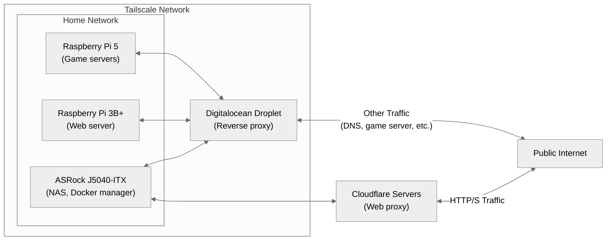

I've been running a few services on my home network for a while now, most notably [Pi-hole](https://pi-hole.net/).
However, I recently decided to expand my home lab network, which ended up being really fun.

## My setup
Below shows an overview of my homelab network.
Physically in my home, I have a Raspberry Pi 5, a Raspberry Pi 3B+, and an ASRock J5040-ITX connected together through a Docker Swarm network.
I also have another Pi 3B+ and a Libre Computer "Le Potato", but I have not appointed any services to run on these yet.
I use the Swarm network to deploy most of my services, which include game servers for me and my friends, a NAS server, the server for this website (which you can read more about [here](/projects/my-website)), etc.

I also use Tailscale to connect all of my homelab devices and personal devices together, so I can access my services remotely.
However, while I can get away with this, in order for my friends to connect to my game servers from their PlayStations, there needs to be a public-facing IP that they can connect to.
So, I am using a cheap $4/month DigitalOcean droplet to act as a reverse proxy for the game server ports into my home network.
For the web traffic, I use CloudFlare tunnels and their proxying service.

## Server rack
For the Pi's & libre computer, I modified a [3D-printable server rack](https://makerworld.com/en/models/1062225-microlab-mini-modular-home-server-rack?from=search#profileId-1050648) that I found to hold the 4 of them.
I was originally going to use it as-is, but I decided to make some custom pieces to hold a gigabit ethernet switch and the four machines.

Below shows a picture of the server rack with 1 Pi installed and the ethernet switch.
I reused the frame and some of the panel pieces from the design, but custom-designed the ethernet switch holders, Pi mounts, and the panel that holds the 4 Pi mounts.
This helped keep everything nice and compact and easy to store.
Not pictured is inside the server rack, where I installed a 6-port USB power supply which supplies each of the four machines, the ethernet switch, and a fan on top from a single AC input in the back.

