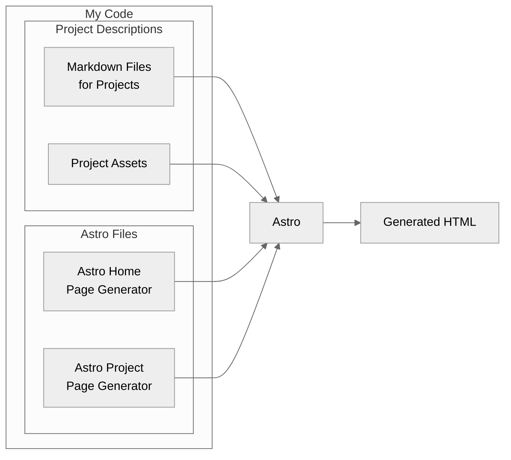
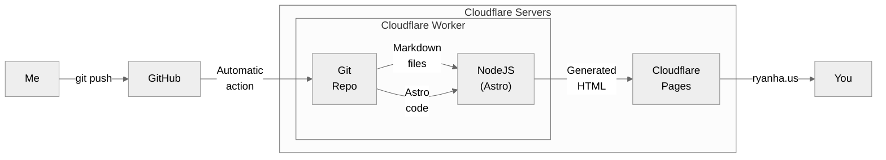
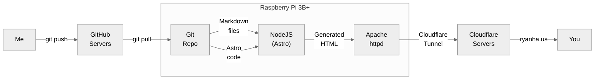

I recently decided to start working on a personal portfolio website, which you are viewing now.

## Content
For this website, I used the [Astro](https://astro.build/) static generator framework to make it easy to organize my projects.
For each project, I write a Markdown file with some metadata at the top and then the content of the page, and Astro (well, my code that *uses* Astro) takes each automatically detected file, renders it to HTML, then also creates the project selection home page based on the projects.
For example, you can see the Markdown source for this page [here](https://github.com/ryanhaus/my-website/blob/main/src/content/projects/my-website.md).

## Hosting & Domain
As for hosting, I was originally using a Raspberry Pi 3B+ within my Docker Swarm homelab network and Apache httpd, but later decided that it would be better to take advantage of Cloudflare's free static site hosting.
I've also hooked up a Cloudflare worker to automatically compile the website's HTML on every Git push.

As for the domain, I'm using Cloudflare Registrar to lease the domain, which they offer at-cost so the domain is pretty cheap (~$6 / year).
This comes with the benefit that I can use Cloudflare's proxying service for free, which I use for a few of my services.

### New setup
As mentioned, I changed the website to be automatically compiled & served by Cloudflare. See the diagram below for a visual representation:

### Old setup
For comparison, this is what it looked like *before* I switched to using Cloudflare workers and static site hosting:

Now I don't have to worry about someone unplugging my server, losing power, or some other issue taking down my website anymore :smile:.
I also don't have to worry about manually pulling & redeploying my website every time I make a change.
I guess I could've used a GitHub action for that, but might as well just make the jump to this if I'm going that route.
