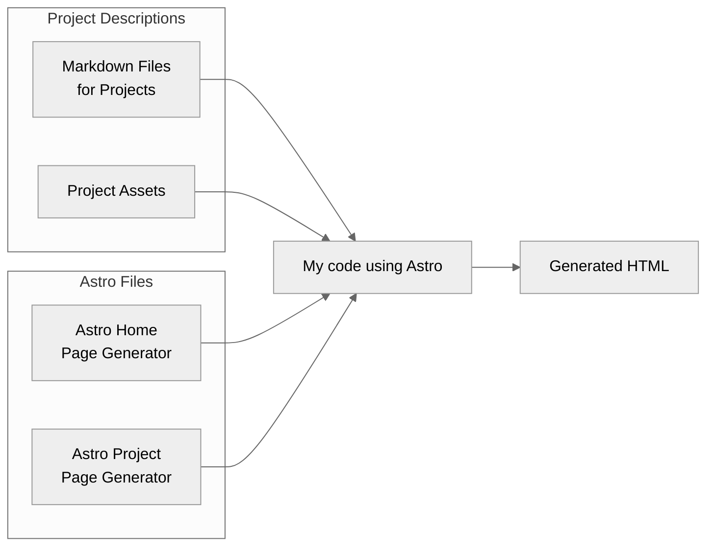
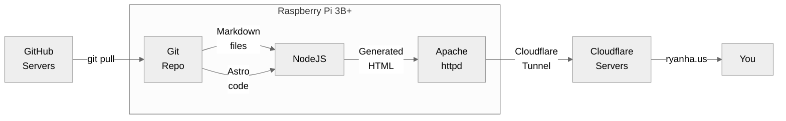

I recently decided to start working on a personal portfolio website, which you are viewing now.

## Content
For this website, I used the [Astro](https://astro.build/) static generator framework to make it easy to organize my projects.
For each project, I write a Markdown file with some metadata at the top and then the content of the page, and Astro (well, my code that *uses* Astro) takes each automatically detected file, renders it to HTML, then also creates the project selection home page based on the projects.
For example, you can see the Markdown source for this page [here](https://github.com/ryanhaus/my-website/blob/main/src/content/projects/my-website.md).

## Hosting & Domain
As for hosting, I am using a Raspberry Pi 3B+ within my Docker Swarm homelab network.
After making changes, I pull the files from GitHub, convert them into static HTML, and then host them in a Docker container with Apache httpd.
In the future, I might want to use GitHub Actions or a webhook to automate this, but this is good enough for now.

As for the domain, I'm using Cloudflare Registrar to lease the domain, which they offer at-cost so the domain is pretty cheap (~$6 / year).
This comes with the benefit that I can use Cloudflare's proxying service for free, meaning that I can configure Cloudflare to tunnel directly into my home network and expose the web server without any port forwarding on my part.
In fact, even though the web server is running on the Pi, you're actually receiving it from Cloudflare and are more than likely viewing a version of this page that is cached on their servers.

See the diagram below for a visual representation:

