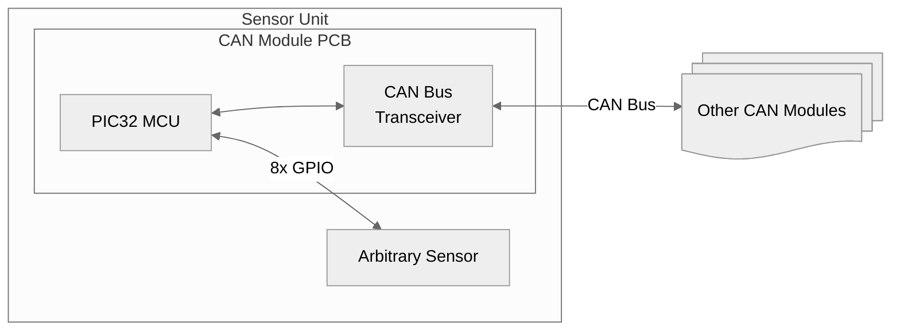
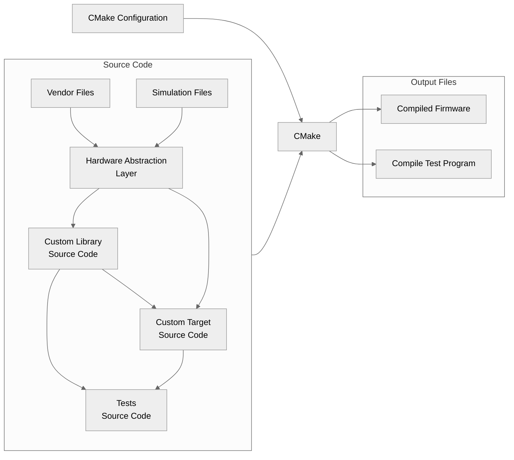

**Note:** this project is still in progress.

As part of Rowan University's [Baja SAE](https://www.bajasae.net/) 2025-2027 team, I had the opportunity to lead the Data Acquisition (DAQ) subsystem.
This subsystem focuses mainly on designing and implementing a network of sensors (i.e., engine RPM, transmission temperature, ride height, suspension travel, etc.) throughout the vehicle and collecting + processing the data.
The data can be used for safety purposes (i.e., detecting an overheating transmission early before failure) but can also be used for improving the performance of the vehicle (i.e., are the shocks reacting as expected when coming down from a jump?).

## High-Level Design
I wanted to base the overall design of this subsystem on how an actual modern road vehicle could be wired.
Upon doing research, I decided that creating a decentralized network of sensors using one shared CAN Bus would be optimal, since it comes with a few benefits:

 - Only 2 wires are required, routing and maintenance will be easier
 - Good EMI resistance & error handling, less worry about data corruption
 - Good enough bandwidth (1 Mbps standard CAN, or up to 8 Mbps for CAN FD)

So, with this, I decided to go with an architecture like the graphic below.
The main building block of the design is the CAN Module PCB, which features a PIC32 microcontroller and a CAN transceiver (among some other things for power filtering etc).

The CAN Module PCB has 8x GPIO pins that can be attached to an arbitrary sensor or other device (i.e., accelerometer, micro SD card, etc.), and also exposes pins to be attached to the shared CAN bus that is routed throughout the vehicle.
Similarly, a shared power bus (+5V and GND) is present, but not pictured in the graphic.

## Hardware
### PCB Design
I used KiCad to design the PCB for this project, with a screenshot shown below.
As mentioned, it features two main chips: a PIC32 microcontroller (U1), and an ATA6560 CAN transceiver (U3).
You can find more details [on my GitHub](https://github.com/ryanhaus/rowan-baja-daq/tree/main/can-module/pcb).

### PCB Assembly
To save on costs (tariffs are *not exactly* making ordering PCBA from China cheap right now!) and also because I just wanted to, I opted to assemble the circuit boards by hand (I would later curse myself for this decision, but it ended up okay :wink:)

I've done plenty of soldering before, but since this had many surface-mount components (including some with pads on the bottom), I needed to pick a new method.
Now, I *could* have used the university's pick & place machine and reflow oven, but that's boring... so I decided to place the components by hand and use a hot plate.

The graphic below shows an overview of the assembly process (click an image to see it up close):

```mermaid
---
config:
    theme: 'neutral'
---
flowchart LR
    blank-board[<a href='/assets/projects/rowan-baja-daq/assembly/blank-board.png' target='_blank'><img src='/assets/projects/rowan-baja-daq/assembly/blank-board.png' /></a> Blank board] -->
    spread-paste[<a href='/assets/projects/rowan-baja-daq/assembly/spread-paste.png' target='_blank'><img src='/assets/projects/rowan-baja-daq/assembly/spread-paste.png' /></a> Spread solder paste] -->
    placed-components[<a href='/assets/projects/rowan-baja-daq/assembly/placed-components.png' target='_blank'><img src='/assets/projects/rowan-baja-daq/assembly/placed-components.png' /></a> Placed components] -->
    melt-solder[<a href='/assets/projects/rowan-baja-daq/assembly/melt-solder.png' target='_blank'><img src='/assets/projects/rowan-baja-daq/assembly/melt-solder.png' /></a> Melted solder paste] -->
    finished[<a href='/assets/projects/rowan-baja-daq/assembly/finished.png' target='_blank'><img src='/assets/projects/rowan-baja-daq/assembly/finished.png' /></a> Removed solder blobs]

```

Finally, after a crap-ton of 0402 components later (19x 0402 R's and C's per board, to be exact), we get the finished product... (nickel for scale)

## Software
I was originally thinking of using an RTOS like FreeRTOS or Zephyr, but I decided it was a bit overkill. So, I opted to just write the software bare-metal in C.

Since the design would require lots of separate CAN Modules, and thus lots of separate software running, I decided to create a compilation scheme using CMake that would make it easy to write different software targets.

A visualization is shown below. The setup is abstracted through a Hardware Abstraction Layer (HAL) that allows for multiple hardware targets, which also allows for simulated tests to be written. Then, the HAL interface is used by custom libraries (i.e., a library for a particular temp sensor chip) and custom targets (approx one per board). CMake takes in all of these files and automatically compiles a simulated test program and also compiles the firmware for each target. More detail is available [at my GitHub](https://github.com/ryanhaus/rowan-baja-daq/tree/main/can-module/software).

