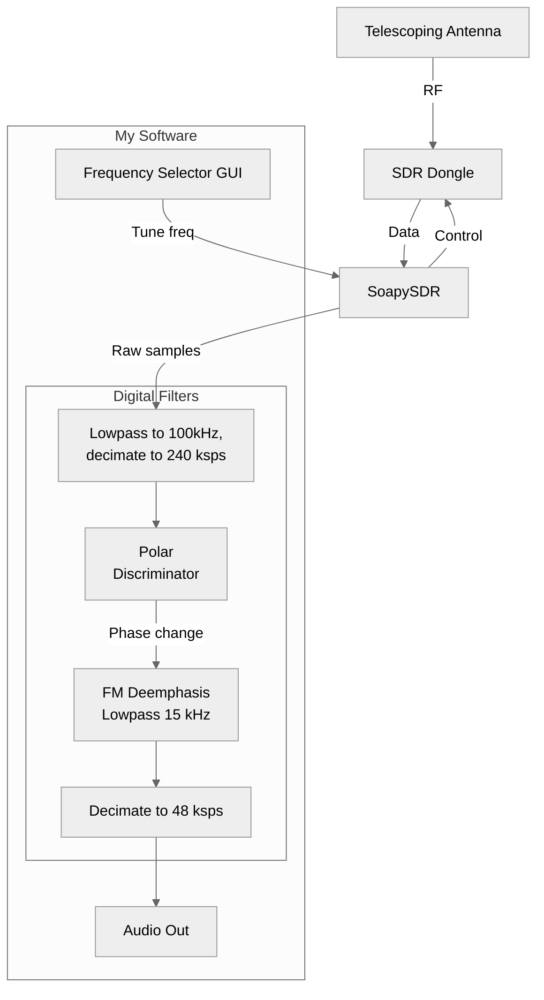

I recently bought a [cheap USB SDR dongle](https://www.amazon.com/dp/B01GDN1T4S) that I had some fun playing around with.
Using premade software to listen to radio stations, air traffic control, etc. is fun and all, but I wanted to do something more with it.
So, I decided to write my own software to interface with the dongle and experiment with digital signal processing, in parallel with taking the DSP course at my school.

## The project
I decided to create an FM radio station demodulator.
I referenced [this page](https://www.site2241.net/march2025.htm), specifically the 'Polar Discriminator' method for FM demodulation.
The software, which is written in C++, creates a GUI made with ImGui + SDL that allows the user to select the channel frequency, which is relayed to the dongle through SoapySDR.
SoapySDR also facilitates getting data from the dongle into the software.

The software receives each sample from SoapySDR at 2.4 Msps, where it first lowpass filters it to 100 kHz and decimates it to 240 ksps (p.s., for the filters, I created a simple FIR filter designer).
This is done to isolate the targeted FM channel (WFM channels in the US have 200 kHz bandwidth) and reduce the amount of processing required.
Then, the software computes the 'polar discriminator', which uses the current and previous samples to compute the change in phase between the two samples, i.e., a scaled measure of the frequency.
Since this converts a frequency into a scalar proportional to the frequency, this effectively demodulates the FM signal. Cool!
After this, an approximation of FM deemphasis is done (just a lowpass with a cutoff of 15 kHz, good enough), decimated to 48 kHz, and the resulting signal is played as audio (scroll down to see a demo).

## Demo
See the video below for a quick demo on me using the software.
I have the software set up to first tune to 101.5 MHz, which corresponds to the "New Jersey 101.5" (WKXW) radio station where I live.
Then, I use the GUI to go over to 104.3 MHz, which is "Q104.3" (WAXQ) in my area.
Then, I just scroll around and find some other radio stations in the area.
In the future, it may be cool to add an auto-seek feature.

<video width="800" controls>
  <source src="/assets/projects/sdr-fm-receiver/demo.mp4" type="video/mp4">
  Your browser does not support the video tag.
</video>
